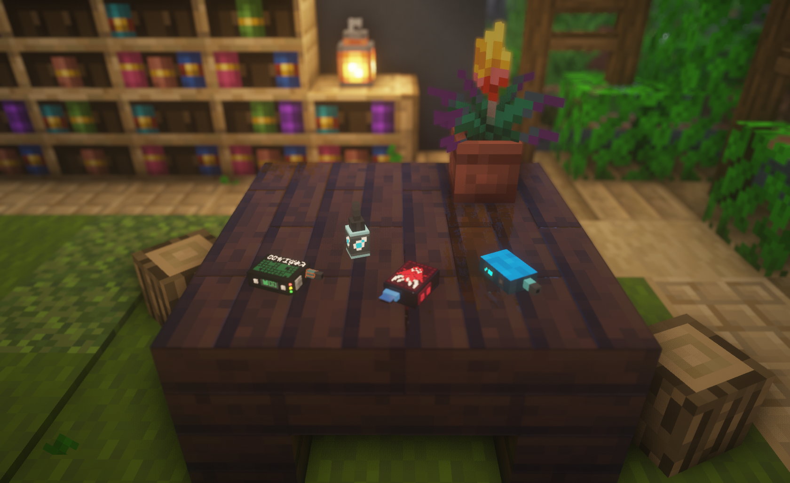

# vapes-resourcepack

[](https://github.com/outbreak-mc/vapes-resourcepack/actions/workflows/build.yml)

Ресурспак, добавляющий вэйпы для плагина на сервере OUTBREAK.



## CustomModelData

### Вэйпы
| Item                 | Material     | CustomModelData |
|----------------------|--------------|-----------------|
| vape_avalanche       | GLASS_BOTTLE | 300006          |
| vape_nebula          | GLASS_BOTTLE | 300007          |
| vape_quadro          | GLASS_BOTTLE | 300008          |
| vape_hikigaeru00     | GLASS_BOTTLE | 300009          |
| vape_hqd             | GLASS_BOTTLE | 300010          |
| vape_jesus_666_s     | GLASS_BOTTLE | 300011          |
| vape_quadro_secret   | GLASS_BOTTLE | 300012          |

### Жижи

| Item                 | Material     | CustomModelData |
|----------------------|--------------|-----------------|
| jija_bolotnaya       | GLASS_BOTTLE | 300002          |
| jija_harcorus        | GLASS_BOTTLE | 300003          |
| jija_outbreak        | GLASS_BOTTLE | 300004          |
| jija_quasar          | GLASS_BOTTLE | 300005          |

### Прочее

| Item                 | Material     | CustomModelData |
|----------------------|--------------|-----------------|
| empty_filler         | GLASS_PANE   | 300000          |
| vape_refill_button   | GLASS_PANE   | 300001          |


## Сборка

Скрипт create_zip.sh предназначен для выполнения его в Docker-контейнере с Ubuntu со следующими переменными окружения:
- `WORK_DIR` - путь к корневой папке этого репозитория внутри контейнера
- `OUT_DIR` - папка в контейнере, в которой появится архив
- `NAME` - имя архива, будет использовано в формате `NAME-VERSION.zip`

Скрипт читает версию из файла `version.txt`, создаёт в контейнере копию проекта, в которой заменяет `%version%` во всех файлах на прочитанную версию, а затем созадёт архив с версией в названии, пропуская ненужные файлы.

Процесс сборки полностью автоматизирован при помощи Docker и запускается командой:

```
docker compose up
```

Результат появится в папке `build` в корне репозитория. Это можно изменить, изменив `OUT_DIR` в файле `.env`.
